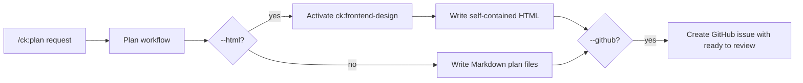

# Phase 1: Skill Flag Semantics

## Context Links

- `claude/skills/ck-plan/SKILL.md`
- `claude/skills/ck-plan/references/output-standards.md`
- `claude/skills/frontend-design/SKILL.md`
- `claude/skills/ui-ux-pro-max/SKILL.md`

## Overview

Update the repo-owned `ck:plan` skill so `--html` and `--github` are first-class composable flags with precise behavior and safety rules.

## Requirements

- Functional: document both flags in frontmatter, mode tables, process flow, output requirements, and handoff rules.
- Functional: `--html` must output a self-contained HTML file instead of Markdown plan artifacts.
- Functional: `--html` must activate `ck:frontend-design` during HTML generation.
- Functional: `--github` must create a GitHub issue with required fields and `ready to review` label.
- Non-functional: keep instructions concise and executable by future agents.

## Architecture

`ck:plan` remains a skill prompt. The new flags guide agent behavior:

## Related Code Files

- Modify: `claude/skills/ck-plan/SKILL.md`
- Modify if needed: `claude/skills/ck-plan/references/output-standards.md`

## Implementation Steps

1. Update `argument-hint` to include `[--html|--github]`.
2. Add composable flag descriptions for `--html` and `--github`.
3. Add HTML output requirements: self-contained `.html`, interactive sections, user flows, diagrams, charts, URL citations, accessible responsive UI.
4. Add GitHub issue requirements: branch, plan summary, relative links, brainstorm report, open questions, `ready to review` label, redaction.
5. Add explicit interaction rule when both flags are present.

## Tests Before

- Grep current skill/catalog flag coverage before editing.

## Refactor

- Update existing instruction sections directly. Do not create alternate enhanced skill files.

## Tests After

- Run skill frontmatter and catalog validation after catalog sync.

## Success Criteria

- [ ] `--html` and `--github` are documented in the skill.
- [ ] `--html` mandates `ck:frontend-design` activation.
- [ ] `--github` includes required issue contents and label behavior.

## Risk Assessment

- Ambiguous artifact replacement could make future agents create both Markdown and HTML. Mitigation: state "instead of Markdown" and define fallback metadata.
- Public GitHub issues may expose sensitive plan details. Mitigation: redaction rule.

## Security Considerations

- Never post secrets, env values, tokens, private customer data, or sensitive logs into generated HTML or GitHub issues.
