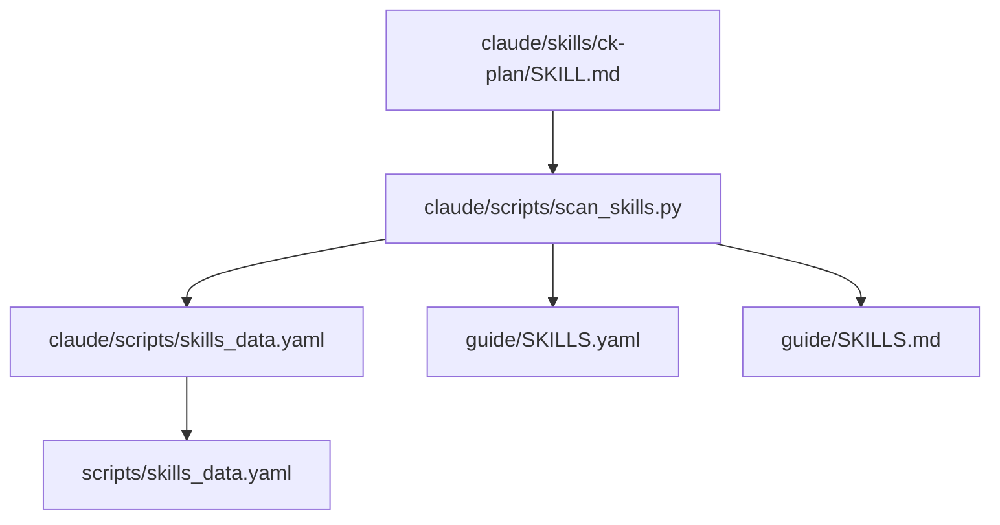

# Phase 2: Catalog And User Skill Sync

## Context Links

- `guide/SKILLS.yaml`
- `guide/SKILLS.md`
- `claude/scripts/skills_data.yaml`
- `scripts/skills_data.yaml`
- `/Users/duynguyen/.agents/skills/ck-plan/SKILL.md`

## Overview

Regenerate checked-in catalogs that surface skill argument hints, then sync the shipped skill to the installed USER-level skill path and verify byte-for-byte equality.

## Requirements

- Functional: generated catalogs include the new ck-plan argument hint.
- Functional: installed USER-level `ck-plan` skill matches repo copy after validation.
- Non-functional: do not edit `~/.claude/skills`; sync only `/Users/duynguyen/.agents/skills/ck-plan/SKILL.md` because prior repo memory says USER-level copies drift.

## Architecture

Catalog flow:

## Related Code Files

- Modify: `guide/SKILLS.yaml`
- Modify: `guide/SKILLS.md`
- Modify: `claude/scripts/skills_data.yaml`
- Modify: `scripts/skills_data.yaml`
- Modify: `/Users/duynguyen/.agents/skills/ck-plan/SKILL.md`

## Implementation Steps

1. Run or patch the existing catalog generation path.
2. If generator cannot update every expected file, patch only generated argument-hint entries that depend on `SKILL.md`.
3. Copy repo `claude/skills/ck-plan/SKILL.md` to `/Users/duynguyen/.agents/skills/ck-plan/SKILL.md` after local validation.
4. Verify USER-level copy with `cmp -s`.

## Tests Before

- Confirm catalog entries currently omit the new flags.

## Refactor

- Keep changes to existing catalog files and skill copy.

## Tests After

- Re-run grep/cmp to verify all visible skill listings agree.

## Success Criteria

- [ ] All catalog argument hints match.
- [ ] USER-level skill copy matches repo skill.

## Risk Assessment

- Manual catalog edits can drift. Mitigation: run validation scripts and targeted grep.

## Security Considerations

- Do not read or write env/secrets files.
