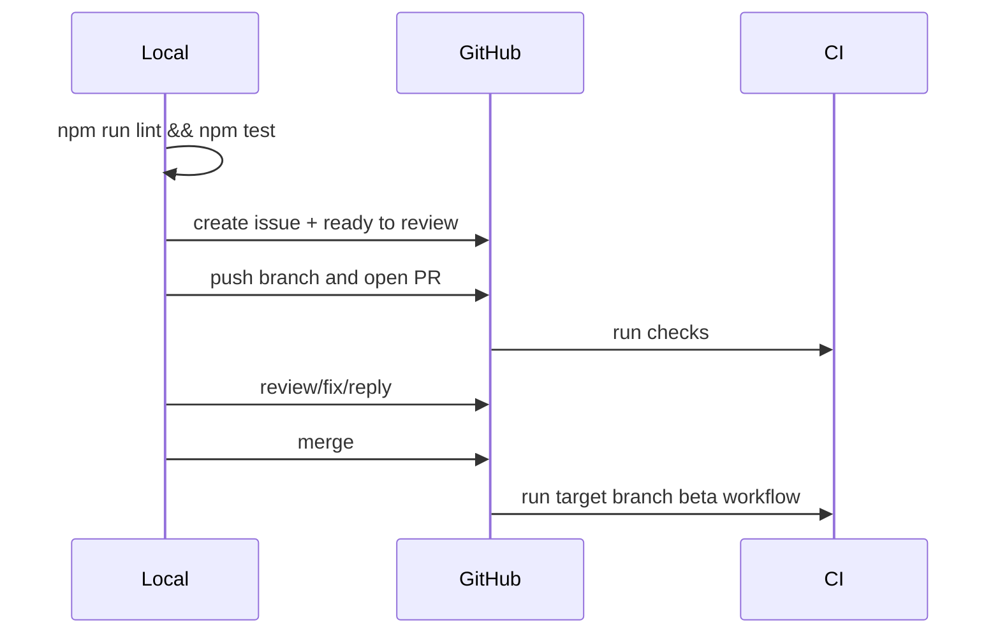

# Phase 3: Validation And Shipping

## Context Links

- `package.json`
- `scripts/check-skill-cross-refs.js`
- `scripts/check-skill-descriptions.js`
- `scripts/check-skill-routing.js`
- GitHub repository: `claudekit/claudekit-engineer`

## Overview

Run local validation, create/update the GitHub issue required by vibe natural-language intake, ship the branch to a beta PR, review it, merge, and watch beta CI.

## Requirements

- Functional: issue includes branch, plan summary, relative plan link, brainstorm report if present, open questions, and `ready to review` label.
- Functional: PR created from `codex/ck-plan-html-github`.
- Functional: beta shipping path ends with merge and target-branch CI green or a documented external blocker.
- Non-functional: no AI attribution in commit/PR text.

## Architecture

Shipping flow:

## Related Code Files

- Modify: local files from phases 1-2
- Create: GitHub issue
- Create: GitHub PR

## Implementation Steps

1. Run targeted validations:
   - `node scripts/check-skill-cross-refs.js`
   - `node scripts/check-skill-descriptions.js`
   - `node scripts/check-skill-routing.js`
   - `npm run lint`
   - `npm test`
2. Create GitHub issue with required `--github` fields and label `ready to review`.
3. Commit with non-`chore`/non-`docs` conventional message because `.claude` skill files changed.
4. Push branch, create PR, monitor checks.
5. Merge via GitHub when checks allow.
6. Watch post-merge beta/dev workflow until green or blocker.

## Tests Before

- Targeted grep and validation before commit.

## Refactor

- Fix any validation failures without weakening checks.

## Tests After

- Re-run failing validation commands until green.

## Success Criteria

- [ ] Local validation green.
- [ ] Issue created with `ready to review`.
- [ ] PR merged or blocker documented.
- [ ] Beta/dev workflow green or external blocker documented.

## Risk Assessment

- GitHub permissions may block issue labels, PR, or merge. Mitigation: stop with exact `gh` error.
- CI may require repo secrets or branch protection. Mitigation: record as external blocker; do not weaken tests.

## Security Considerations

- Redact local-only paths only when posting public text is not needed; repo-relative plan links are safe.
- Never publish secrets or private env values.
